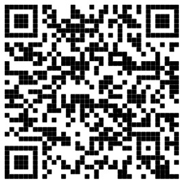

# Prácticas y manuales de uso de Proteus 9

Imagen Para descargar App Proteus para control IoT (Solo Android)

  

Este repositorio contiene el manual de Proteus 9 creado por Breismam.

## 📖 Contenido

- **Drivers**: Drivers para interfaz gráfica en proyectos IoT  
- **Fourier/Audios**: Proyectos relacionados con análisis de señales y audio
- **Guia Propilot + Gemini**: Documentación para habilitar IA de Gemini en Proteus 9
- **Librerías Arduino**: Manual, proyecto de prueba y librerías para usar el compilador de Arduino en Proteus  
- **Plantillas de trabajo**: Sección dedicada para la creación de templates o plantillas personalizadas  
- **Proyectos IoT**: Proyecto IoT con distintas tarjetas
- **Proyectos**: Ejemplos y prácticas usando diferentes funciones de proteus como el depurador de código y librerías de arduino
- **STLINK V3 MINIE**: Configuración y uso del programador/debugger  
- **LICENSE.md**: Normas de uso del contenido de este repositorio  
- **README.md**: Archivo de descripción del repositorio  

En cada subcarpeta o carpeta de los diferentes proyectos habrá un **PDF** con la explicación correspondiente.

## 📌 Licencia
Este manual se distribuye bajo la licencia  
[Creative Commons Attribution-NonCommercial-NoDerivatives 4.0 International (CC BY-NC-ND 4.0)](https://creativecommons.org/licenses/by-nc-nd/4.0/).

No se permite modificarlo ni utilizarlo con fines comerciales.  
Se requiere atribución al autor: © 2026 Breismam Alfonso Rueda Díaz.
